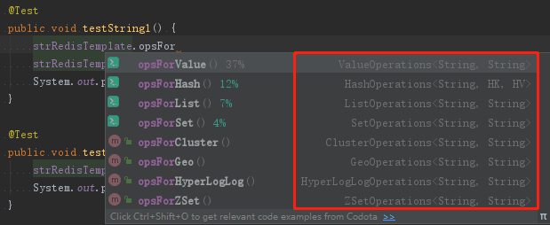

# Spring Boot + Redis

## 简介
Spring Boot 使用 Jedis 客户端 集成 Redis。

## 版本
* springVersion: 5.2.6.RELEASE
* springBootVersion: 2.3.0.RELEASE

## 在 Windows 下启动 Redis
在 redis 文件夹下面，双击 run.bat 启动 Redis


## 集成说明

**1.maven 坐标**
```xml
<!-- Redis -->
<dependency>
    <groupId>org.springframework.boot</groupId>
    <artifactId>spring-boot-starter-data-redis</artifactId>
</dependency>
```

**2.application.yml**
```yml
spring:
  #redis基础配置
  redis:
    # Redis服务器地址
    host: 127.0.0.1
    # Redis数据库索引（默认为0）
    database: 0
    # Redis服务器连接端口
    port: 6379
    # 链接超时时间 单位 ms（毫秒）
    timeout: 3000
    # 密码
    password: 123456
    # 连接池配置（jedis/lettuce）
    jedis:
      pool:
        # 连接池中的最大空闲连接 默认 8
        max-active: 8
        # 连接池最大阻塞等待时间（使用负值表示没有限制） 默认 -1
        max-wait: -1
        # 连接池中的最大空闲连接 默认 8
        max-idle: 8
        # 连接池中的最小空闲连接 默认 0
        min-idle: 0
```

**3.RedisConfig.java**
```java
@Configuration
public class RedisConfig {
    /**
     * 配置RedisTemplate
     *
     * @param redisConnectionFactory 连接工厂
     * @return RedisTemplate
     */
    @Bean
    public RedisTemplate<String, Serializable> redisTemplate(RedisConnectionFactory redisConnectionFactory) {
        RedisTemplate<String, Serializable> redisTemplate = new RedisTemplate<>();
        //设置key的存储方式为字符串
        redisTemplate.setKeySerializer(new StringRedisSerializer());
        //设置为value的存储方式为JDK二进制序列化方式，还有jackson序列化方式（Jackson2JsonRedisSerialize）
        redisTemplate.setValueSerializer(new JdkSerializationRedisSerializer());
        //设置连接工厂
        redisTemplate.setConnectionFactory(redisConnectionFactory);
        return redisTemplate;
    }
}
```

**4. 测试**
```java
@RunWith(SpringRunner.class)
@SpringBootTest
public class SpringBootRedisApplicationTests {

    @Autowired
    private RedisTemplate<String, String> strRedisTemplate;
    @Autowired
    private RedisTemplate<String, Serializable> serializableRedisTemplate;

    @Test
    public void testString1() {
        strRedisTemplate.opsForValue().set("redis_test:strKey", "acgkaka");
        System.out.println(strRedisTemplate.opsForValue().get("redis_test:strKey"));
    }

    @Test
    public void testString2() {
        strRedisTemplate.boundValueOps("redis_test:strKey222").set("acgkaka222");
        System.out.println(strRedisTemplate.boundValueOps("redis_test:strKey222").get());
    }

    @Test
    public void testSerializable() {
        UserEntity user = new UserEntity();
        user.setId(1L);
        user.setUserName("清风烟柳");
        user.setUserSex("男");
        serializableRedisTemplate.opsForValue().set("redis_test:user", user);
        UserEntity user2 = (UserEntity) serializableRedisTemplate.opsForValue().get("redis_test:user");
        System.out.println("user:" + user2.getId() + "," + user2.getUserName() + "," + user2.getUserSex());
    }
}
```
**运行结果1：**


**运行结果2：**


**运行结果3：**


> 经测试，发现 **boundValueOps()** 和 **opsForValue()** 都可以正常存取值，没有发现差异。

**Redis Desktop Manager**

**数据1：**

**数据2：**

**数据3：**


## 知识点补充

> * ValueOperations：简单K-V操作
> * HashOperations：针对Map类型的数据操作
> * ListOperations：针对List类型的数据操作
> * SetOperations：Set类型数据操作
> * ClusterOperations：Cluster集群分区操作
> * GeoOperations：地理空间操作
> * HyperLogLogOperations：被用于估计一个 set 中元素数量的概率性的数据结构操作
> * ZSetOperations：ZSet类型数据操作（ZSet是有序Set）